# Awesome Blockchain Analytics 🚀

  

  
  
  
  
  
  

---

## 🌟 Top Blockchain Analytics & On-Chain Intelligence Ecosystem 🔍

**Curated List of Enterprise SaaS Platforms & Open-Source GitHub Projects** 📊  
*Focused on Crypto Forensics, Transaction Monitoring, Address Attribution & Smart Contract Indexing* 🛡️

**Last updated: September 2026** 📅

This repository tracks notable **SaaS platforms** and **open-source projects** for **Blockchain Analytics**. These tools analyze on-chain data to trace fund flows, attribute addresses to real-world entities, detect illicit activity, enforce AML/CFT compliance, and provide market intelligence for compliance teams, investigators, traders, and web3 developers. 🧠

**Open-source emphasis**: This section is expanded with active projects for self-hosting, custom forensics, and transparent data pipelines — ideal for researchers, compliance teams, and developers building vendor-independent blockchain intelligence. 🛠️

---

## 📑 Table of Contents

- [🏢 SaaS & Hosted Platforms](#-saas--hosted-platforms)
- [💻 Open-Source GitHub Projects](#-open-source-github-projects)
- [💡 How to Contribute](#-how-to-contribute)
- [⚠️ Disclaimer](#%EF%B8%8F-disclaimer)
- [❤️ Support & Sponsorship](#%EF%B8%8F-support--sponsorship)
- [📈 Star History](#-star-history)

---

## 🏢 SaaS & Hosted Platforms

> [!NOTE]
> **Market Size & Fragmentation**: The global blockchain analytics and intelligence market is estimated at **~$3.2 Billion (2026)** and projected to grow rapidly. The commercial intelligence and compliance sector is **highly concentrated** (dominated by key leaders like Chainalysis, TRM Labs, and Elliptic due to network effects around proprietary wallet attribution databases and regulatory trust), while retail and developer analytics remain **moderately fragmented**.

*Sorted by estimated company revenue / valuation in descending order:* 📈

| Platform 🌐 | Scale / Valuation 💰 | Starting Paid Tier 💵 | Free Tier / Trial Limit 🎁 | Description & Core Focus ℹ️ |
| :--- | :--- | :--- | :--- | :--- |
| **[Chainalysis](https://www.chainalysis.com/)** | ~$8.6B Valuation / ~$200M+ ARR | ~$20,000 / year (Enterprise) | 14-day free trial for compliance & screening APIs | Market leader for compliance, sanctions screening, and government forensics (Reactor). |
| **[TRM Labs](https://www.trmlabs.com/)** | ~$1.0B+ Valuation / ~$80M+ ARR | ~$15,000 / year (Enterprise) | 14-day request-based enterprise demo trial | Multi-chain risk management, wallet screening, and investigation suite. |
| **[Dune](https://dune.com/)** | ~$1.0B Valuation / ~$30M ARR | $390 / month (Plus Plan) | Free Forever: 2,500 credits/mo, public dashboards & SQL editor | Community SQL analytics platform for querying cross-chain on-chain data. |
| **[Elliptic](https://www.elliptic.co/)** | ~$500M Valuation / ~$50M ARR | ~$10,000 / year (Enterprise) | 14-day trial available via enterprise contact | Crypto risk management, transaction monitoring, and financial crime investigation. |
| **[Nansen](https://www.nansen.ai/)** | ~$750M Valuation / ~$25M ARR | $99 / month (Pioneer Plan) | Free Forever: Basic wallet labels, public dashboards & token overview | Smart Money tracking, wallet attribution, DeFi & NFT analytics. |
| **[Glassnode](https://glassnode.com/)** | ~$250M Valuation / ~$20M ARR | $29 / month (Standard Plan) | Free Forever: Tier 1 metrics (24h delayed data, basic charts) | Institutional on-chain market intelligence and Bitcoin/Ethereum macro indicators. |
| **[Covalent](https://www.covalenthq.com/)** | ~$150M Valuation / ~$12M ARR | $50 / month (Premium Plan) | Free Forever: 100,000 API credits/month across 100+ chains | Structured unified API for historical wallet, token, and transaction data. |
| **[Bitquery](https://bitquery.io/)** | ~$50M Valuation / ~$8M ARR | $49 / month (Developer Plan) | Free Forever: 10,000 points/month GraphQL query limit | Multi-chain GraphQL APIs and DEX WebSocket data streams. |
| **[Arkham](https://www.arkhamintelligence.com/)** | ~$300M Token MCap / ~$5M ARR | Custom Enterprise API tier | Free Forever: Unlimited public entity intelligence & deanonymization platform | Deanonymization platform tracking entity wallets and real-time alerts. |
| **[Flipside](https://flipsidecrypto.xyz/)** | ~$30M Funding / ~$5M ARR | $150 / month (Pro API Tier) | Free Forever: Unlimited SQL queries & community data bounties | SQL data platform with community-driven analytics and data science bounties. |

---

## 💻 Open-Source GitHub Projects

*Sorted by GitHub Star Count in descending order:* ⭐

- **[Blockscout](https://github.com/blockscout/blockscout)**  🔍  
  Open-source, self-hostable EVM block explorer providing contract verification, GraphQL APIs, and developer tools for 800+ networks and rollups.

- **[SubQuery](https://github.com/subquery/subql)**  ⚡  
  Open-source decentralized data indexer providing custom GraphQL APIs for Web3 projects across 150+ supported chains.

- **[TrueBlocks](https://github.com/TrueBlocks/trueblocks-core)**  🛡️  
  Local-first, index-driven toolchain for fast, private access to complete EVM blockchain history without relying on RPC providers.

- **[Ponder](https://github.com/ponder-sh/ponder)**  🚀  
  High-performance open-source framework for building Web3 backend APIs and indexing blockchain event data in TypeScript.

- **[Otterscan](https://github.com/otterscan/otterscan)**  🏎️  
  Ultra-fast, ultra-lightweight local Ethereum block explorer tailored for execution client nodes (Erigon, Reth).

- **[Sourcify](https://github.com/ethereum/sourcify)**  📜  
  Decentralized open-source smart contract source code verification service and metadata registry for EVM chains.

- **[Cryo](https://github.com/paradigmxyz/cryo)**  ❄️  
  Extremely fast CLI and Rust library developed by Paradigm for extracting EVM blockchain data to Parquet, CSV, or Python DataFrames.

- **[DipDup](https://github.com/dipdup-io/dipdup)**  🐍  
  Python framework for building selective smart contract indexers with SQLite/PostgreSQL storage and GraphQL APIs.

- **[GraphSense](https://github.com/graphsense)**  🔬  
  The premier open-source cryptoasset analytics and forensics platform (EU Horizon TITANIUM project). Provides address clustering, entity graphs, and flow analysis for BTC, ETH, LTC, ZEC, and BCH.

- **[HyperIndex (Envio)](https://github.com/enviodev/hyperindex)**  ⚡  
  Ultra-fast multichain indexer delivering up to 2000x faster historical event ingestion via HyperSync across EVM, SVM, and Fuel chains.

- **[Ethernal](https://github.com/tryethernal/ethernal)**  🌐  
  Self-hostable block explorer designed for local EVM development chains (Hardhat, Anvil, Ganache) with contract debugging tools.

- **[Marble](https://github.com/checkmarble/marble)**  🛡️  
  Open-source real-time transaction monitoring and AML decision engine for crypto exchanges and fintechs with screening & case management.

- **[Blobscan](https://github.com/blobscan/blobscan)**  📦  
  The first open-source block explorer dedicated to indexing and analyzing EIP-4844 blob data on Ethereum.

- **[Shovel](https://github.com/indexsupply/shovel)**  ⛏️  
  Lightweight Ethereum-to-Postgres indexer designed to transform block and event logs into structured relational tables using simple JSON rules.

- **[BRK (Bitcoin Research Kit)](https://github.com/bitcoinresearchkit/brk)**  📊  
  High-performance open-source toolchain for parsing, computing metrics, and visualizing data directly from a local Bitcoin Core node.

- **[ofi-chain-forensics](https://github.com/Ciprian-LocalPulse/ofi-chain-forensics-en)**  🔎  
  Python library for blockchain money-laundering detection and transaction graph analysis implementing address clustering and risk scoring.

- **[Chainslake](https://github.com/chainslake/chainslake)**  🏢  
  Self-hosted blockchain data warehouse built on Apache Spark, Trino, and Delta Lake, offering an on-premise alternative to commercial SQL platforms.

- **[Ape Wisdom](https://github.com/apewisdom/apewisdom)**  🐒  
  Open-source sentiment and smart money tracking prototype for monitoring high-profile crypto wallet activities.

---

### 🛠️ Additional Open-Source Developer Tools & Data Pipelines

- **[Spice](https://github.com/spicehq/spice)**  — Unified SQL data engine and CLI for querying crypto datasets locally. 🌶️
- **[Paradigm Data Portal](https://github.com/paradigmxyz/data-portal)**  — Open-source repository of standardized crypto research datasets. 📂
- **[Flair](https://github.com/flair-sdk/flair-sdk)**  — Reusable, fault-tolerant indexing primitives for custom multi-chain ingest pipelines. ⚙️

---

## 💡 How to Contribute

Contributions are highly appreciated! Help keep this repository up-to-date and comprehensive. ✨

1. **Fork** the repository. 🍴
2. **Add/Edit** entries in [README.md](file:///C:/Users/hp/Documents/Projects/Awesome-Blockchain-Analytics/README.md) adhering to the existing structure.
3. Ensure tools are classified under **SaaS/Hosted** or **Open-Source**. 📌
4. Submit a **Pull Request** with a detailed summary. 🚀

Check out our reference hub at [Awesome-Awesome-Awesome](https://github.com/ishandutta2007/Awesome-Awesome-Awesome) for more curated lists! 🌟

---

## ⚠️ Disclaimer

- This list is **community-curated** for educational and research purposes.
- Usage of blockchain analytics tools must conform to legal AML/CFT frameworks, sanctions regulations, and regional data privacy laws. ⚖️
- Open-source risk scoring engines provide heuristic indicators rather than automated legal proof. 🛡️

---

## ❤️ Support & Sponsorship

Thank you for visiting and supporting the **Awesome Blockchain Analytics** project! 🙏

If you find this repository valuable for your research, forensic investigations, or development stack, please consider:
- ⭐ **Starring** this repository to increase visibility.
- 🔄 **Forking & Sharing** with fellow researchers, analysts, and developers.
- ☕ **Buying me a coffee** to support ongoing maintenance:

  

---

## 📈 Star History

